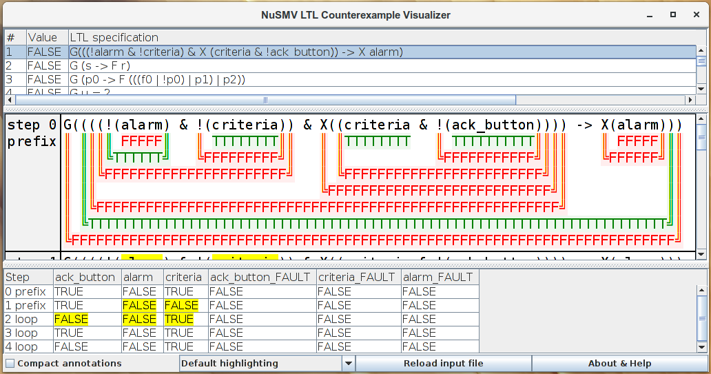

# NuSMV LTL counterexample visualizer

This tool explains why a particular LTL formula fails on a particular trace by means of causal analysis and structured visualization. Below you can see the explanation of the formula's false outcome (middle) and variable values that are important for this outcome (bottom).

Cite:

* Pakonen A., Buzhinsky I., Vyatkin V. Counterexample visualization and explanation for function block diagrams. 16th IEEE International Conference on Industrial Informatics (INDIN). July 18–20, 2018, Porto, Portugal, pp. 747–753. IEEE, 2018 [[web]](https://ieeexplore.ieee.org/document/8472025) [[preprint]](https://ctlab.itmo.ru/~buzhinsky/papers/indin-2018.pdf)

## Notes on the input format

* The input file to the tool is the output file of NuSMV with LTL formulas and corresponding counterexample traces.
* Bounded operators (e.g., G[0, 3]) in LTL formulas are not supported. You will have to rewrite them manually (e.g., with X).
* All arithmetic operators supported by NuSMV should work.
* Supported past-time LTL operators: Y, Z, O, H. Unsupported past-time LTL operators: T, S.
* Since nuXmv counterexamples usually have the same format as NuSMV ones, the tool may be used on nuXmv counterexamples. Real (rational) data type is supported by the tool but timed traces and formulas are not.

## Running

The tool can be run on Windows, Mac OS, Linux. Requires [Java 8 or higher](http://www.oracle.com/technetwork/java/javase/downloads/index.html) to be installed on your system.

Simply run [jars/visualizer-gui.jar](/jars/visualizer-gui.jar). Alternatively, or if this does not work, you can run the tool from the console:

> java -jar jars/visualizer-gui.jar

You can select the input file (for example, [example-input.txt](/example-input.txt)) either in the dialog window or in the command line:

> java -jar jars/visualizer-gui.jar example-input.txt

Font sizes can be configured via command line options --mainFontSize &lt;size&gt; and --auxFontSize &lt;size&gt;.

The colors of the default highlighting mode can be configured via command line options --highlightColor &lt;color&gt;, --trueColor &lt;color&gt;, --falseColor &lt;color&gt;. Another option --highlightChar &lt;char&gt; specifies the character used to highlight important Boolean values.

A purely console version of the tool is also available:

> java -jar jars/visualizer-console.jar

## GUI help

The top panel lists LTL specifications from the input file. Visualization is available only for FALSE specifications. Select a FALSE specification to see the visualization of the counterexample for this specification in the middle panel.

In the middle panel, the values (T = true, F = false) of each subformula of the LTL specification are shown for each step of the counterexample. Click on an annotation below a subformula to see an explanation of its value. As a result, this and some other values will be highlighted. In addition, important atomic propositions are highlighted in the LTL formula.

An additional compact highlighting mode is available which displays subformula values on the same line where the formula is displayed. Explanations also work in this mode.

In the bottom panel, the values of all variables for all counterexample steps are provided. The values which are present in the LTL formula are shown on the left. Important values are highlighted.

Highlighting of important atomic propositions is implemented (with some enhancements) according to the polynomial algorithm from: I. Beer, S. Ben-David, H. Chockler, A. Orni, R. Trefler. Explaining counterexamples using causality. Computer Aided Verification, pp. 94-108, 2009. Springer Berlin/Heidelberg.

## Building

If you need to modify the source of the tool and you have JDK 1.8 or higher, you can rebuild it with [ant](https://ant.apache.org/):

> ant

## Extended input format & educational use of the tool

The tool supports the extension of the NuSMV output format, namely:

* Traces on which the LTL formula is TRUE are supported (the TRUE value of the formula will be explained). In this case, "is false" in the end can be replaced with "is true". Moreover, there is no need to write "is false" or "is true" at all, the value will be determined automatically.
* When NuSMV outputs LTL formulas, it puts redundant parentheses. In the input to the tool, they can be omitted. In this case, precedence of binary operators is U/V, &, |/xor/xnor, <->, -> (-> associates to the right). This complies with how NuSMV operates.
* LTL operator Release can be specified as V (NuSMV expresses this operator via Until).
* State numbers in traces can be omitted, i.e. "&nbsp;&nbsp;&nbsp;&nbsp;-> <-" would specify the start of the new trace element.
* No lines to start the trace (such as "-- as demonstrated by the following execution sequence") are required.

These extensions simplify the use of the tool when the input is produced manually (not by NuSMV). In particular, this can be useful to learn/teach LTL semantics.

## Bugs

If you see an error or something strange, you can open an issue here or email Igor Buzhinsky (igor.buzhinsky@gmail.com).